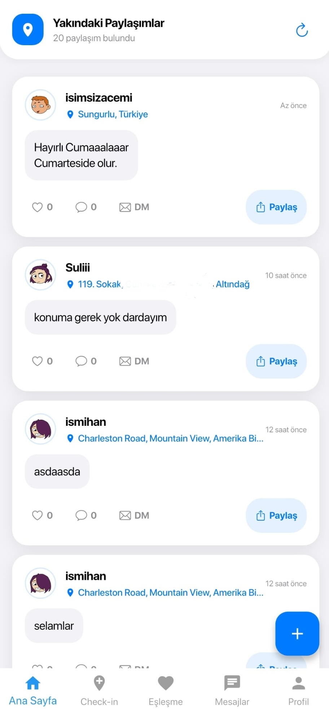
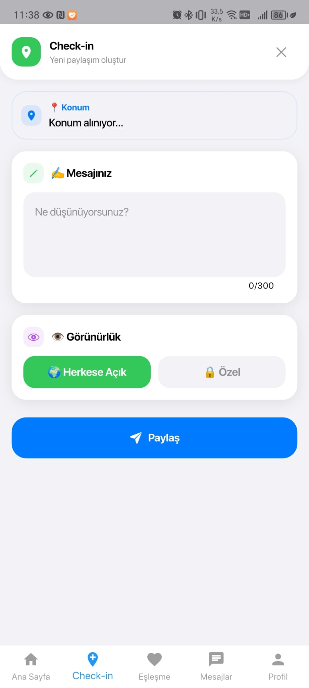
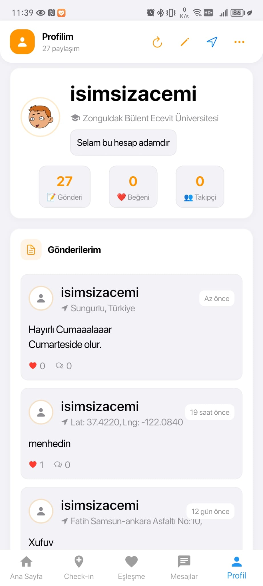
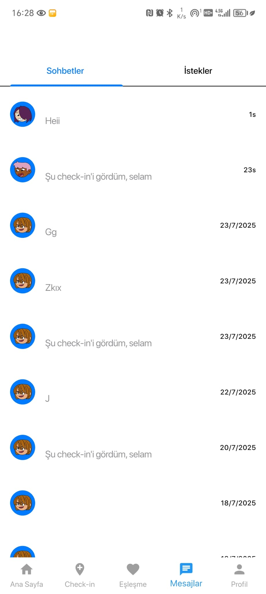
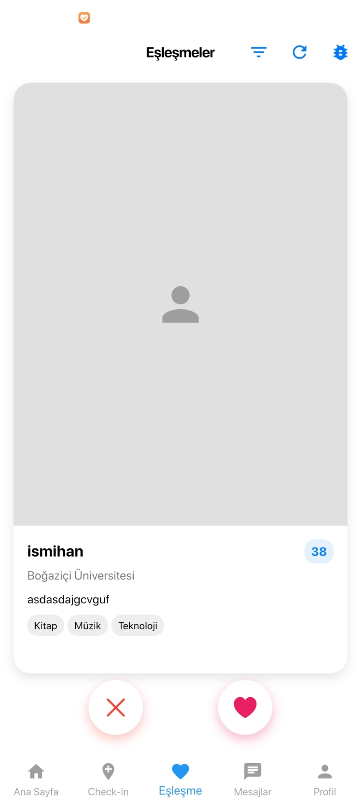
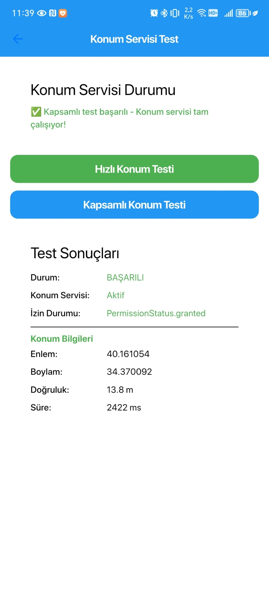

# nearFriend

<div align="center">
  
  
  
  
</div>

<div align="center">
  <h3>📍 Yakındaki Arkadaşlarınızı Keşfedin</h3>
  <p>Üniversite öğrencileri için konum tabanlı sosyal etkileşim uygulaması</p>
  
  [](nearFriend)
</div>

## 📱 Uygulama Görünümü

<div align="center">
  
  
  <h4>🎯 Ana Özellikler</h4>
  
  <table>
    <tr>
      <td align="center">
        
        <br><strong>Ana Sayfa</strong>
      </td>
      <td align="center">
        
        <br><strong>Check-in Paylaşımı</strong>
      </td>
    </tr>
    <tr>
      <td align="center">
        
        <br><strong>Profil Sayfası</strong>
      </td>
      <td align="center">
        
        <br><strong>Profil Düzenleme</strong>
      </td>
    </tr>
    <tr>
      <td align="center">
        
        <br><strong>Mesajlar & İstekler</strong>
      </td>
      <td align="center">
        
        <br><strong>Eşleşme Sistemi</strong>
      </td>
    </tr>
    <tr>
      <td align="center" colspan="2">
        
        <br><strong>Konum Test Servisi</strong>
      </td>
    </tr>
  </table>
</div>

## ✨ Özellikler

### 📍 Konum Tabanlı
- **Yakındaki paylaşımları görün** - 30km yarıçapında
- **Mesafe hesaplama** - Haversine formülü ile doğru mesafe
- **Akıllı sıralama** - Yakından uzağa + zamana göre

### 👥 Sosyal Etkileşim
- **Check-in paylaşımı** - Bulunduğun yeri paylaş
- **DM istekleri** - Yakındaki kişilerle iletişim kur
- **Gerçek zamanlı mesajlaşma** - Anlık sohbet
- **Beğeni sistemi** - Paylaşımları beğen

### 🎯 Üniversite Odaklı
- **Üniversite filtresi** - Kendi üniversitendekileri gör
- **Yaş aralığı** - 18-30 yaş arası
- **İlgi alanları** - Ortak ilgi alanlarına göre eşleşme

### 🔒 Gizlilik
- **Görünürlük kontrolü** - Herkese açık veya özel
- **Güvenli kimlik doğrulama** - Firebase Auth
- **Konum gizliliği** - Sadece gerekli durumlarda paylaşım

### 🎨 Modern UI/UX
- **iOS tarzı tasarım** - Cupertino Design
- **Karanlık/Aydınlık tema** - Otomatik geçiş
- **Responsive tasarım** - Tüm ekran boyutları

## 🛠️ Teknolojiler

### Frontend
- **Flutter 3.16.0** - Cross-platform UI framework
- **Dart 3.2.0** - Programming language
- **Cupertino Design** - iOS-style UI components

### Backend & Services
- **Firebase Authentication** - Güvenli kimlik doğrulama
- **Cloud Firestore** - NoSQL veritabanı
- **Firebase Storage** - Dosya depolama
- **Firebase Cloud Messaging** - Push bildirimleri

### Location & Maps
- **Google Maps API** - Harita entegrasyonu
- **Location Plugin** - GPS konum servisleri
- **Geocoding API** - Adres çözümleme

### State Management
- **Provider** - State management
- **Shared Preferences** - Yerel depolama
- **Cached Network Image** - Resim önbellekleme

## 🚀 Kurulum

### Geliştirici Kurulumu

1. **Repository'yi klonlayın**
   ```bash
   git clone https://github.com/yourusername/nearfriend.git
   cd nearfriend/near_friend
   ```

2. **Bağımlılıkları yükleyin**
   ```bash
   flutter pub get
   ```

3. **Firebase yapılandırması**
   - Firebase Console'da yeni proje oluşturun
   - `google-services.json` dosyasını `android/app/` klasörüne ekleyin
   - Firebase Authentication, Firestore ve Storage'ı etkinleştirin

4. **API Anahtarlarını yapılandırın**
   - Google Maps API anahtarını alın
   - `android/app/src/main/AndroidManifest.xml` dosyasına ekleyin

5. **Uygulamayı çalıştırın**
   ```bash
   flutter run
   ```

### Gereksinimler
- Flutter SDK 3.16.0+
- Dart SDK 3.2.0+
- Android Studio / VS Code
- Firebase hesabı

### 🔧 Kurulum Notu
Firebase yapılandırması için `google-services.json` dosyasını `android/app/src/` klasörüne eklemeyi unutmayın.

## 📁 Proje Yapısı

```
lib/
├── main.dart                 # Uygulama giriş noktası
├── models/                   # Veri modelleri
│   ├── checkin_model.dart
│   ├── user_model.dart
│   └── message_model.dart
├── screens/                  # UI ekranları
│   ├── feed_screen.dart      # Ana akış
│   ├── checkin_screen.dart   # Check-in oluşturma
│   ├── chat_screen.dart      # Mesajlaşma
│   └── profile_screen.dart   # Profil yönetimi
├── services/                 # İş mantığı servisleri
│   ├── auth_service.dart
│   ├── geocoding_service.dart
│   └── time_service.dart
├── utils/                    # Yardımcı fonksiyonlar
│   ├── app_theme.dart
│   └── location_debug.dart
└── widgets/                  # Yeniden kullanılabilir widget'lar
    └── smart_avatar.dart
```

## 📱 APK İndirme

### 🚀 Hemen Deneyin!

Uygulamayı hemen denemek için APK dosyasını indirin:

[](nearFriend)

### 📋 Kurulum Adımları:

1. **APK'yı indirin** - Yukarıdaki butona tıklayın
2. **Bilinmeyen kaynaklara izin verin** - Ayarlar > Güvenlik > Bilinmeyen kaynaklar
3. **APK'yı yükleyin** - İndirilen dosyaya tıklayın
4. **Uygulamayı açın** - nearFriend'i kullanmaya başlayın!

### 🔒 Güvenlik:
- APK dosyası güvenlidir
- Kaynak kodu açık
- Firebase ile güvenli kimlik doğrulama
- Konum verileriniz gizli tutulur

### 📊 APK Bilgileri:
- **Boyut**: ~25MB
- **Android Sürümü**: 5.0+ (API 21+)
- **Güncelleme Tarihi**: Son sürüm
- **Sürüm**: 1.0.0

## Katkıda Bulunma

Detaylar için [CONTRIBUTING.md](CONTRIBUTING.md) dosyasını inceleyin.

## Lisans

MIT License - [LICENSE](LICENSE) dosyasına bakın.
